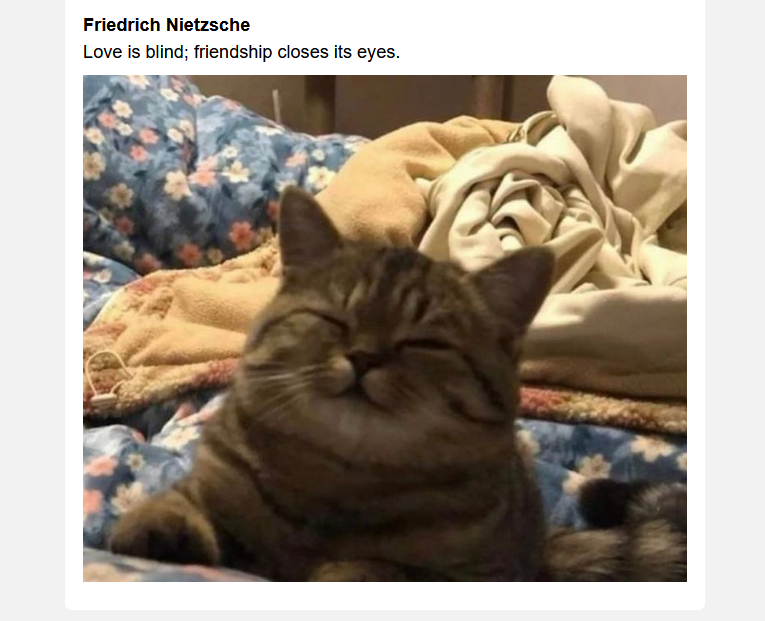
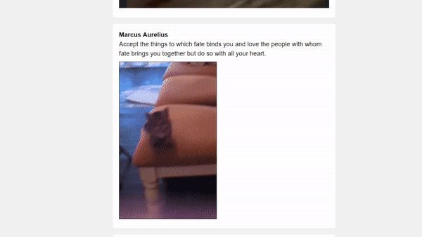

# Infinite Cats

Random cats and quotes.





## Running app

1. Create virtual env

```
python -m venv .venv
```

2. Install dependencies

```
pip install -r requirements.txt
```

3. Run app

```
python -m app
```
